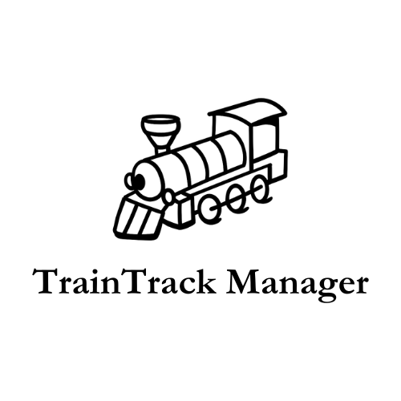
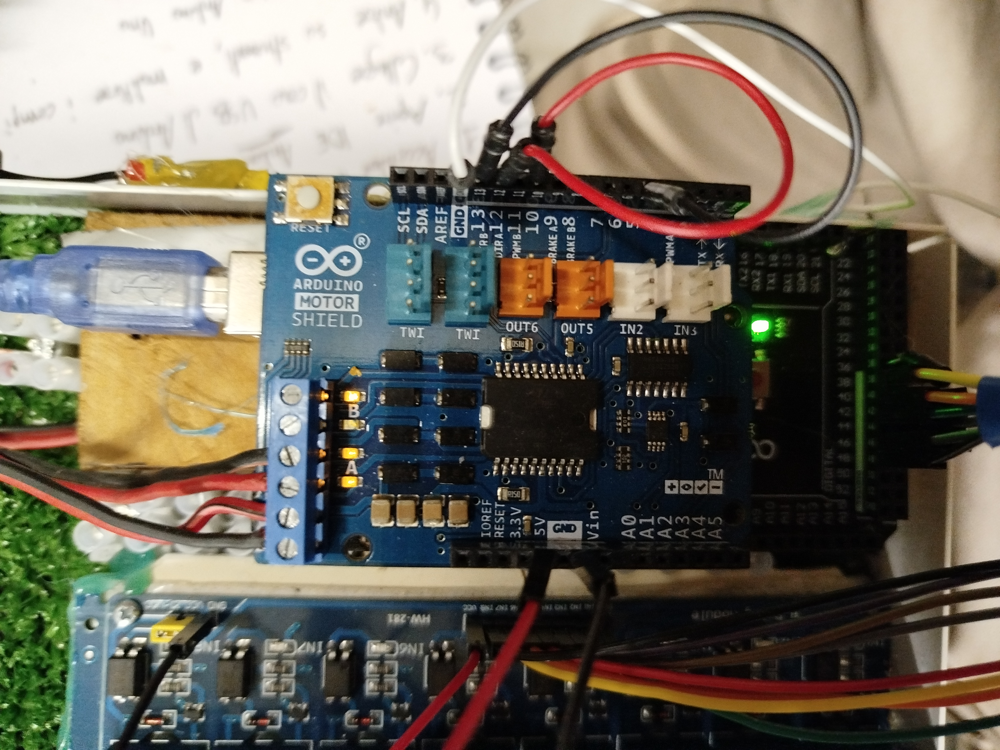
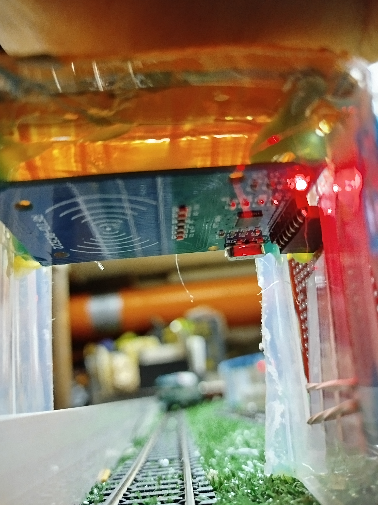
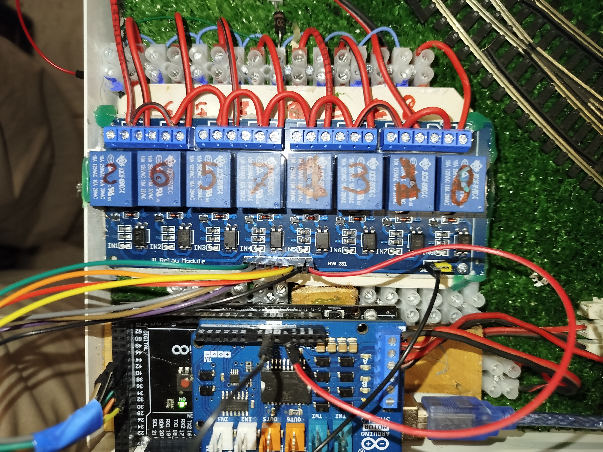
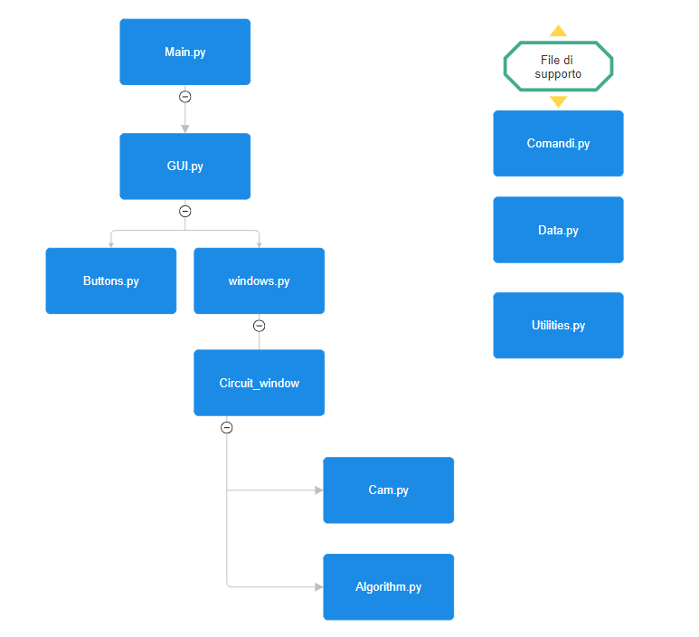

  <h1>TrainTrack Manager - Docs</h1>
  

  <b>Italiano</b> | <a href="README_en.md">English</a>

  

Sistema integrato per il controllo, il monitoraggio e la gestione di un plastico ferroviario tramite **Arduino** e **Python**.

  <video src="https://github.com/user-attachments/assets/4eb8992b-b024-4acb-93e2-5e106119a5ab"  controls muted autoplay loop>
    Il tuo browser non supporta il video.
  </video>

## Download e Release (Pre-release)

L'ultima versione dell'applicazione è disponibile come **eseguibile standalone per Windows 64-bit**.

* **Download**: [Pagina delle Release](https://github.com/AlessioCammarata/TrainTrack-Manager-Docs/releases)
* **Installazione**: 
    1. Scarica il file `TrainTrackManager_v0.9.0_Win64.zip` dalla sezione **Assets** (NON scaricare i file "Source code").
    2. Estrai la cartella sul tuo PC.
    3. Avvia `TrainTrackManager.exe`.
  
>Importante: Non spostare il file TrainTrackManager.exe al di fuori della cartella estratta. La struttura delle cartelle deve rimanere esattamente così com'è; l'eseguibile ha bisogno di trovare le sottocartelle /assets e /languages nella loro posizione originale per funzionare .
* **Nota**: Mantieni le cartelle `/assets` e `/languages` nella stessa directory dell'eseguibile per il corretto funzionamento dell'interfaccia.
* **Preview Mode**: È possibile esplorare la GUI e il database anche senza Arduino collegato.

## Panoramica

**TrainTrack Manager** è un ecosistema domotico che combina:
- **Controllo locomotive**: Gestione digitale DCC tramite libreria **DCCpp**.
- **Gestione scambi**: Comando manuale dei deviatoi e protezioni elettriche attive.
- **Rilevamento posizione**: Tracking in tempo reale tramite rete di sensori **RFID (MFRC522)**.
- **Applicazione desktop**: Interfaccia grafica in Python (Tkinter) con gestione concorrente (thread/queue).
- **Monitoraggio video (opzionale)**: Integrazione flussi video con OpenCV.

  
*Il plastico ferroviario TrainTrack Manager in assetto completo durante una sessione di test.*

---

## Stato del progetto (importante)

Attualmente sono disponibili:
- Controllo completo da GUI di **più locomotive contemporaneamente**
- Comando **manuale** di tutti gli scambi (deviatoi)
- **Rilevazione tag RFID** attiva e scambio dati per capire dove si trova un treno in ogni momento (lato applicazione)
- **Second view** con videocamera (OpenCV) opzionale per il monitoraggio live

🚧 **In sviluppo:** la modalità **automatica** non è ancora completa.  
In particolare manca la logica che attiva **automaticamente i deviatoi** in base alla posizione rilevata (RFID) e al percorso assegnato.

## Repository collegati

- **Codice (app + firmware):** `AlessioCammarata/TrainTrack-Manager` (Privato)
- **Documentazione (questa repo):** `AlessioCammarata/TrainTrack-Manager-Docs` (Pubblico)

## Architettura Hardware (high-level)

Il progetto adotta un approccio a “doppio livello” separando la potenza dalla logica dei sensori:

### 1) Controllo Potenza & Locomotive — Arduino Mega 2560
* Generazione e gestione del segnale DCC tramite libreria **DCCpp**.
* Invio comandi ai decoder delle locomotive attraverso **Motor Shield Rev3**.

### 2) Tracking & Sensori — Arduino Uno Rev3
* Rete di sensori **RFID MFRC522** per identificare univocamente le locomotive al passaggio.
* Comunicazione standard su bus **SPI**.

### Gestione scambi e protezione circuitale
* Modulo **relè optoisolato** per comandare i deviatoi a 18V, garantendo la separazione fisica tra potenza e logica di Arduino.
* Utilizzo di diodi e LED polarizzati per mitigare i ritorni induttivi dalle bobine.

---

## Architettura Software

* **Python (GUI + logica):** Interfaccia grafica OOP sviluppata in **Tkinter**.
* **Concorrenza:** Gestione tramite `threading` e `queue` (logica FIFO) per la lettura asincrona dei sensori senza bloccare la UI.
* **Comunicazione seriale:** Libreria `pyserial` per il dialogo costante PC ↔ Arduino.
* **Computer Vision:** Integrazione flussi video via **OpenCV** per il monitoraggio live.

  
*Diagramma delle dipendenze logiche tra i moduli del programma.*

## Automazione e Sicurezza

L’algoritmo di controllo lavora in ciclo continuo per garantire la sicurezza del plastico:

1. **Acquisizione**: Lettura degli eventi RFID dalla coda FIFO.
2. **Analisi**: Calcolo dei **punti critici** (intersezioni e potenziali conflitti tra i percorsi assegnati).
3. **Intervento (WIP)**: Gestione automatica dei deviatoi e/o arresto della locomotiva per prevenire collisioni (attivazione automatica deviatoi non ancora completa).

## Layout del Circuito

  
*Vista zenitale del plastico ferroviario TrainTrack Manager durante i test di automazione.*

## Riferimenti tecnici

* **DCCpp**: Stack per il controllo digitale DCC delle locomotive.
* **MFRC522**: Driver per sensori RFID.
* **pySerial**: Comunicazione seriale Python ↔ Arduino.

## Autore

**Alessio Cammarata** — Progetto realizzato come elaborato per l'Esame di Stato A.S. 2023/2024 (Informatica e Telecomunicazioni).

## Licenza

Questo progetto è rilasciato sotto licenza **MIT**. Consulta il file `LICENSE` per maggiori dettagli.